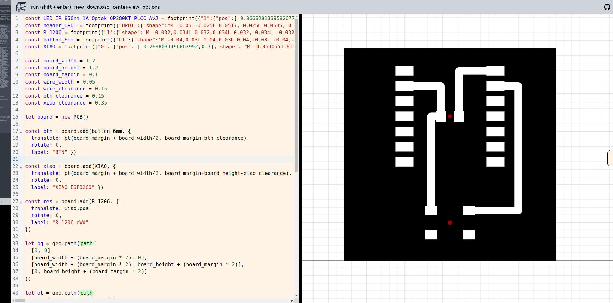
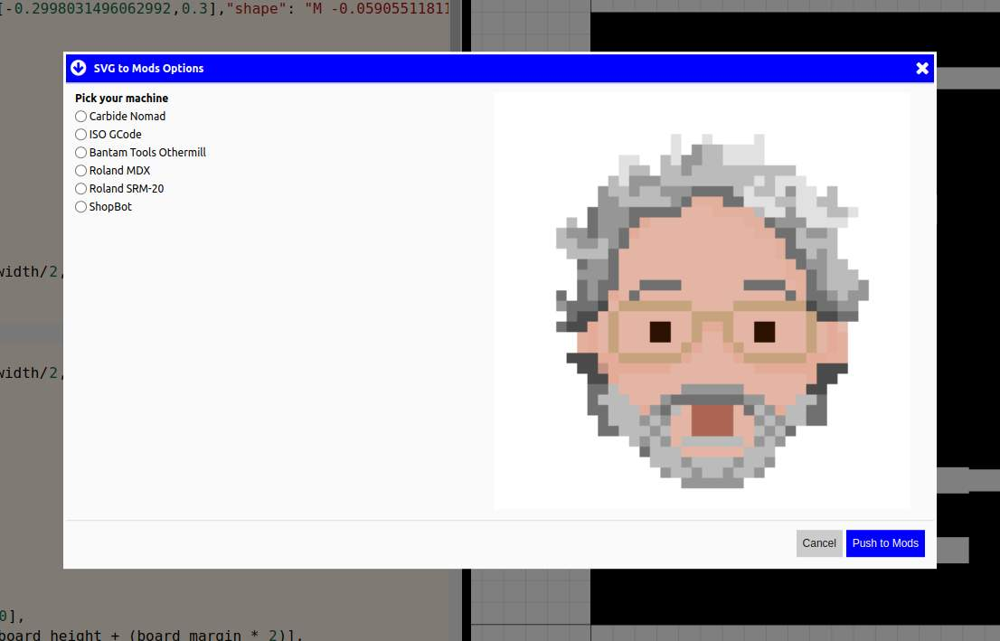
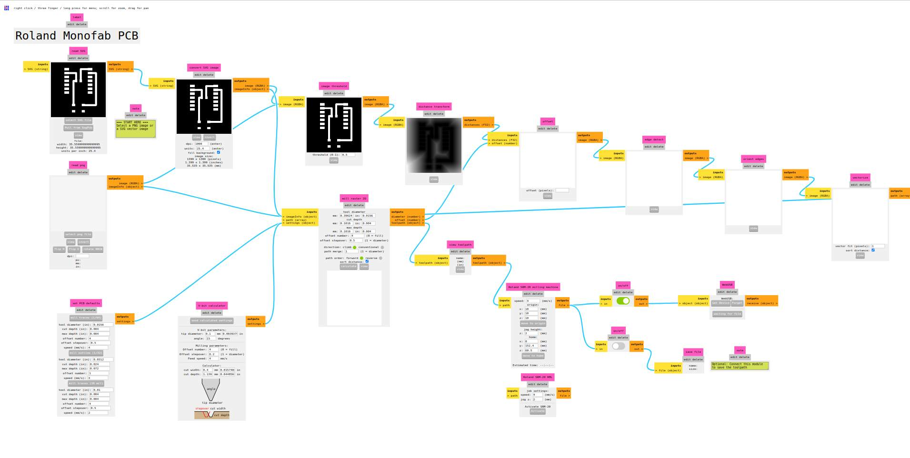
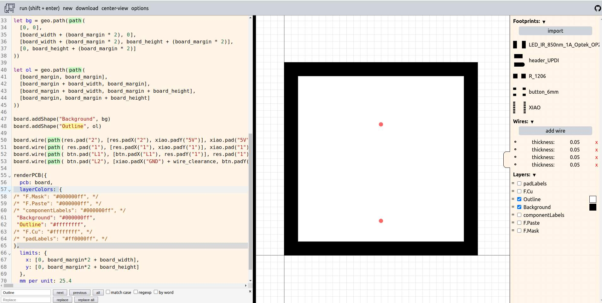
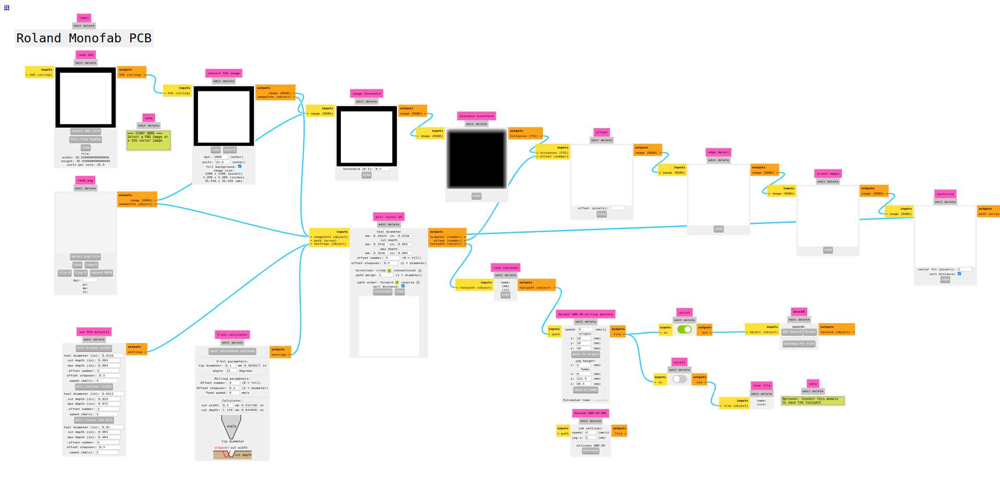

# Download Mods

This page describes the workflow for direct export to [Mods](https://modsproject.org/) for PCB milling with your favorite machine.

## What is Mods

Mods is in-browser node-based multi-purpose digital fabrication software initially developed as a research project at the [MIT CBA](https://cba.mit.edu/) by Neil Gershenfeld. It has become a community project recently and you can participate in its development via [Fab GitLab](https://gitlab.fabcloud.org/pub/project/mods).

## PCB Design for Mods

In order to use Mods for PCB milling, you need to take into account a few design constraints.

1. Mods recognizes white color as copper and black as negative space, thus in your PCB design it is best to use black (`#000000ff`) for background and white (`#ffffffff`) for component pads, vias and wires.
1. Leave a margin around the board outline (`0.1` inches is OK) as Mods needs a few black pixels around the board outline (interior) shape to calculate milling paths around it.
1. At the moment you have to export images for each Mods milling process (traces, outline) separately, thus before exporting make sure that you have shown/hidden the layers and see the output as it is expected by the Mods milling process.

## Example

Copy and paste the code below in SvgPcb editor.

```
const LED_IR_850nm_1A_Optek_OP280KT_PLCC_AvJ = footprint({"1":{"pos":[-0.06692913385826771,0],"shape":"M -0.02952755905511811 0.05905511811023622 L 0.02952755905511811 0.05905511811023622 L 0.02952755905511811 -0.05905511811023622 L -0.02952755905511811 -0.05905511811023622 L -0.02952755905511811 0.05905511811023622 ","layers":["F.Cu","F.Paste","F.Mask"]},"2":{"pos":[0.07086614173228346,0],"shape":"M -0.02952755905511811 0.05905511811023622 L 0.02952755905511811 0.05905511811023622 L 0.02952755905511811 -0.05905511811023622 L -0.02952755905511811 -0.05905511811023622 L -0.02952755905511811 0.05905511811023622 ","layers":["F.Cu","F.Paste","F.Mask"]}});
const header_UPDI = footprint({"UPDI":{"shape":"M -0.05,-0.025L 0.0517,-0.025L 0.0535,-0.0248L 0.0552,-0.0244L 0.056,-0.0243L 0.0578,-0.0237L 0.0593,-0.0232L 0.0602,-0.0229L 0.061,-0.0225L 0.0618,-0.0221L 0.0625,-0.0216L 0.0633,-0.0212L 0.064,-0.0208L 0.0654,-0.0197L 0.0661,-0.0191L 0.0668,-0.0186L 0.0686,-0.0168L 0.0691,-0.0161L 0.0697,-0.0154L 0.0708,-0.014L 0.0712,-0.0133L 0.0716,-0.0125L 0.0721,-0.0118L 0.0725,-0.011L 0.0729,-0.0102L 0.0732,-0.0093L 0.0737,-0.0078L 0.0743,-0.006L 0.0744,-0.0052L 0.0748,-0.0035L 0.075,-0.0017L 0.075,-0.0009L 0.075,0L 0.075,0.0009L 0.075,0.0017L 0.0748,0.0035L 0.0744,0.0052L 0.0743,0.006L 0.0737,0.0078L 0.0732,0.0093L 0.0729,0.0102L 0.0725,0.011L 0.0721,0.0118L 0.0716,0.0125L 0.0712,0.0133L 0.0708,0.014L 0.0697,0.0154L 0.0691,0.0161L 0.0686,0.0168L 0.0668,0.0186L 0.0661,0.0191L 0.0654,0.0197L 0.064,0.0208L 0.0633,0.0212L 0.0625,0.0216L 0.0618,0.0221L 0.061,0.0225L 0.0602,0.0229L 0.0593,0.0232L 0.0578,0.0237L 0.056,0.0243L 0.0552,0.0244L 0.0535,0.0248L 0.0517,0.025L 0.0509,0.025L 0.05,0.025L -0.05,0.025L -0.05,-0.025","pos":[0,-0.05],"layers":["F.Cu","F.Mask"],"index":1},"GND":{"shape":"M -0.05,0.025L 0.05,0.025L 0.05,-0.025L -0.05,-0.025L -0.05,0.025","pos":[0,0.05],"layers":["F.Cu","F.Mask"],"index":2}});
const R_1206 = footprint({"1":{"shape":"M -0.032,0.034L 0.032,0.034L 0.032,-0.034L -0.032,-0.034L -0.032,0.034","pos":[-0.06,0],"layers":["F.Cu","F.Mask"],"index":1},"2":{"shape":"M -0.032,0.034L 0.032,0.034L 0.032,-0.034L -0.032,-0.034L -0.032,0.034","pos":[0.06,0],"layers":["F.Cu","F.Mask"],"index":2}});
const button_6mm = footprint({"L1":{"shape":"M -0.04,0.03L 0.04,0.03L 0.04,-0.03L -0.04,-0.03L -0.04,0.03","pos":[-0.125,0.08],"layers":["F.Cu","F.Mask"],"index":1},"R1":{"shape":"M -0.04,0.03L 0.04,0.03L 0.04,-0.03L -0.04,-0.03L -0.04,0.03","pos":[-0.125,-0.08],"layers":["F.Cu","F.Mask"],"index":2},"R2":{"shape":"M -0.04,0.03L 0.04,0.03L 0.04,-0.03L -0.04,-0.03L -0.04,0.03","pos":[0.125,-0.08],"layers":["F.Cu","F.Mask"],"index":3},"L2":{"shape":"M -0.04,0.03L 0.04,0.03L 0.04,-0.03L -0.04,-0.03L -0.04,0.03","pos":[0.125,0.08],"layers":["F.Cu","F.Mask"],"index":4}});
const XIAO = footprint({"0": {"pos": [-0.2998031496062992,0.3],"shape": "M -0.05905511811023622 0.031496062992125984 L 0.05905511811023622 0.031496062992125984 L 0.05905511811023622 -0.031496062992125984 L -0.05905511811023622 -0.031496062992125984 L -0.05905511811023622 0.031496062992125984 ","layers": ["F.Cu","F.Paste","F.Mask"],"drill": {"diameter": null,"start": "F.Cu","end": "B.Cu","plated": true}},"1": {"pos": [-0.2998031496062992,0.2],"shape": "M -0.05905511811023622 0.031496062992125984 L 0.05905511811023622 0.031496062992125984 L 0.05905511811023622 -0.031496062992125984 L -0.05905511811023622 -0.031496062992125984 L -0.05905511811023622 0.031496062992125984 ","layers": ["F.Cu","F.Paste","F.Mask"],"drill": {"diameter": null,"start": "F.Cu","end": "B.Cu","plated": true}},"2": {"pos": [-0.2998031496062992,0.1],"shape": "M -0.05905511811023622 0.031496062992125984 L 0.05905511811023622 0.031496062992125984 L 0.05905511811023622 -0.031496062992125984 L -0.05905511811023622 -0.031496062992125984 L -0.05905511811023622 0.031496062992125984 ","layers": ["F.Cu","F.Paste","F.Mask"],"drill": {"diameter": null,"start": "F.Cu","end": "B.Cu","plated": true}},"3": {"pos": [-0.2998031496062992,0],"shape": "M -0.05905511811023622 0.031496062992125984 L 0.05905511811023622 0.031496062992125984 L 0.05905511811023622 -0.031496062992125984 L -0.05905511811023622 -0.031496062992125984 L -0.05905511811023622 0.031496062992125984 ","layers": ["F.Cu","F.Paste","F.Mask"],"drill": {"diameter": null,"start": "F.Cu","end": "B.Cu","plated": true}},"4": {"pos": [-0.2998031496062992,-0.1],"shape": "M -0.05905511811023622 0.031496062992125984 L 0.05905511811023622 0.031496062992125984 L 0.05905511811023622 -0.031496062992125984 L -0.05905511811023622 -0.031496062992125984 L -0.05905511811023622 0.031496062992125984 ","layers": ["F.Cu","F.Paste","F.Mask"],"drill": {"diameter": null,"start": "F.Cu","end": "B.Cu","plated": true}},"5": {"pos": [-0.2998031496062992,-0.2],"shape": "M -0.05905511811023622 0.031496062992125984 L 0.05905511811023622 0.031496062992125984 L 0.05905511811023622 -0.031496062992125984 L -0.05905511811023622 -0.031496062992125984 L -0.05905511811023622 0.031496062992125984 ","layers": ["F.Cu","F.Paste","F.Mask"],"drill": {"diameter": null,"start": "F.Cu","end": "B.Cu","plated": true}},"6": {"pos": [-0.2998031496062992,-0.3],"shape": "M -0.05905511811023622 0.031496062992125984 L 0.05905511811023622 0.031496062992125984 L 0.05905511811023622 -0.031496062992125984 L -0.05905511811023622 -0.031496062992125984 L -0.05905511811023622 0.031496062992125984 ","layers": ["F.Cu","F.Paste","F.Mask"],"drill": {"diameter": null,"start": "F.Cu","end": "B.Cu","plated": true}},"7": {"pos": [0.3,-0.3],"shape": "M -0.05905511811023622 0.031496062992125984 L 0.05905511811023622 0.031496062992125984 L 0.05905511811023622 -0.031496062992125984 L -0.05905511811023622 -0.031496062992125984 L -0.05905511811023622 0.031496062992125984 ","layers": ["F.Cu","F.Paste","F.Mask"],"drill": {"diameter": null,"start": "F.Cu","end": "B.Cu","plated": true}},"8": {"pos": [0.3,-0.2],"shape": "M -0.05905511811023622 0.031496062992125984 L 0.05905511811023622 0.031496062992125984 L 0.05905511811023622 -0.031496062992125984 L -0.05905511811023622 -0.031496062992125984 L -0.05905511811023622 0.031496062992125984 ","layers": ["F.Cu","F.Paste","F.Mask"],"drill": {"diameter": null,"start": "F.Cu","end": "B.Cu","plated": true}},"9": {"pos": [0.3,-0.1],"shape": "M -0.05905511811023622 0.031496062992125984 L 0.05905511811023622 0.031496062992125984 L 0.05905511811023622 -0.031496062992125984 L -0.05905511811023622 -0.031496062992125984 L -0.05905511811023622 0.031496062992125984 ","layers": ["F.Cu","F.Paste","F.Mask"],"drill": {"diameter": null,"start": "F.Cu","end": "B.Cu","plated": true}},"10": {"pos": [0.3,0],"shape": "M -0.05905511811023622 0.031496062992125984 L 0.05905511811023622 0.031496062992125984 L 0.05905511811023622 -0.031496062992125984 L -0.05905511811023622 -0.031496062992125984 L -0.05905511811023622 0.031496062992125984 ","layers": ["F.Cu","F.Paste","F.Mask"],"drill": {"diameter": null,"start": "F.Cu","end": "B.Cu","plated": true}},"3V3": {"pos": [0.3,0.1],"shape": "M -0.05905511811023622 0.031496062992125984 L 0.05905511811023622 0.031496062992125984 L 0.05905511811023622 -0.031496062992125984 L -0.05905511811023622 -0.031496062992125984 L -0.05905511811023622 0.031496062992125984 ","layers": ["F.Cu","F.Paste","F.Mask"],"drill": {"diameter": null,"start": "F.Cu","end": "B.Cu","plated": true}},"GND": {"pos": [0.3,0.2],"shape": "M -0.05905511811023622 0.031496062992125984 L 0.05905511811023622 0.031496062992125984 L 0.05905511811023622 -0.031496062992125984 L -0.05905511811023622 -0.031496062992125984 L -0.05905511811023622 0.031496062992125984 ","layers": ["F.Cu","F.Paste","F.Mask"],"drill": {"diameter": null,"start": "F.Cu","end": "B.Cu","plated": true}},"5V": {"pos": [0.3,0.3],"shape": "M -0.05905511811023622 0.031496062992125984 L 0.05905511811023622 0.031496062992125984 L 0.05905511811023622 -0.031496062992125984 L -0.05905511811023622 -0.031496062992125984 L -0.05905511811023622 0.031496062992125984 ","layers": ["F.Cu","F.Paste","F.Mask"],"drill": {"diameter": null,"start": "F.Cu","end": "B.Cu","plated": true}}});

const board_width = 1.2
const board_height = 1.2
const board_margin = 0.1
const wire_width = 0.05
const wire_clearance = 0.15
const btn_clearance = 0.15
const xiao_clearance = 0.35

let board = new PCB()

const btn = board.add(button_6mm, { 
  translate: pt(board_margin + board_width/2, board_margin+btn_clearance), 
  rotate: 0, 
  label: "BTN" })

const xiao = board.add(XIAO, { 
  translate: pt(board_margin + board_width/2, board_margin+board_height-xiao_clearance), 
  rotate: 0, 
  label: "XIAO ESP32C3" })

const res = board.add(R_1206, { 
  translate: xiao.pos, 
  rotate: 0, 
  label: "R_1206_eWd" 
})

let bg = geo.path(path(
  [0, 0],
  [board_width + (board_margin * 2), 0],
  [board_width + (board_margin * 2), board_height + (board_margin * 2)],
  [0, board_height + (board_margin * 2)]
))

let ol = geo.path(path(
  [board_margin, board_margin],
  [board_margin + board_width, board_margin],
  [board_margin + board_width, board_margin + board_height],
  [board_margin, board_margin + board_height]
))

board.addShape("Background", bg)
board.addShape("Outline", ol)

board.wire(path(res.pad("2"), [res.padX("2"), xiao.padY("5V")], xiao.pad("5V"),), wire_width, "F.Cu")
board.wire(path( res.pad("1"), [res.padX("1"), xiao.padY("1")], xiao.pad("1"), ), wire_width, "F.Cu")
board.wire(path( btn.pad("L1"), [btn.padX("L1"), res.padY("1")], res.pad("1"), res.pad("1"),), wire_width, "F.Cu")
board.wire(path( btn.pad("L2"), [xiao.padX("GND") + wire_clearance, btn.padY("L2")], [xiao.padX("GND") + wire_clearance, xiao.padY("GND")], xiao.pad("GND"),), wire_width, "F.Cu")

renderPCB({
  pcb: board,
  layerColors: {
/* "F.Mask": "#000000ff", */
/* "F.Paste": "#000000ff", */
/* "componentLabels": "#000000ff", */
 "Background": "#000000ff",
/* "Outline": "#ffffffff", */
 "F.Cu": "#ffffffff",
/* "padLabels": "#ff0000ff", */
},
  limits: {
    x: [0, board_margin*2 + board_width],
    y: [0, board_margin*2 + board_height]
  },
  mm_per_unit: 25.4
})

```

You should see this.



## Miiling Traces

Open the side-panel and look at the **Layers** section. The following layers should be checked visible at this point.

- F.Cu
- Background

Click on **download > mods** and a modal should open. 



Select one of the available machines and click **Push to Mods**! A new tab will open and you should see the following.



Continue with the flow of milling traces with Mods.

## Milling Outline

In order to proceed with the outline milling process, make sure you have selected the following layers in the side-panel of SvgPcb.

- Outline
- Background

You should see the following.



Click on **download > mods** again, select your milling machine and **Push to Mods**! A new tab should open and you should see the following.



Continue with the flow of milling outline with Mods.

That is it! Happy SvgPcb and PCB milling with Mods!