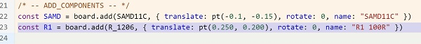
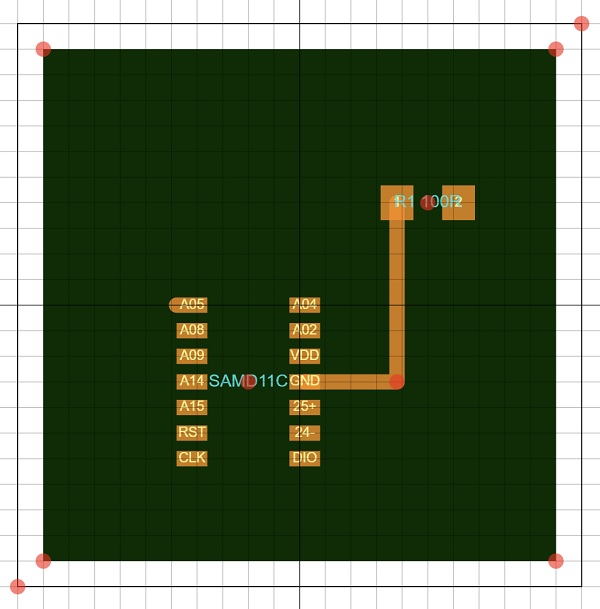

# SVG-PCB

**SVG-PCB is…a browser-based, parametric Printed Circuit Board (PCB) design app**.  

Using a combination of **Javascript code** and **graphical drawing tools**, circuit board designs can be drawn and exported as a SVG, PNG file for production (etching, masking, milling, etc) as well as a JS code file.  

**SVG-PCB**’s functionality is similar to other PCB design, formally called Electronic Design Automation (EDA), software such as Eagle, KiCAD or EasyEDA. While similar in ultimate functionality, **SVG-PCB** has some significant differences from those traditional PCB EDAs, including…  

- No **Schematic** diagram creation > the program IS the schematic  
- No **Ratsnest** feature > pad connection relationships are explicitly defined in code  
- No **Design Rules Check** > Design Rules can be coded into the program and control the output  
- No **Electrical Rules Check** > ....yet!  
- No **Auto-routing** > ...yet!   
- Does not require installation...is **browser-based**   

And of course the most notable difference is that **SVG-PCB** is an EDA that is centered upon **Javascript programming**...while having some very useful graphical user interface (GUI) features to make for a unique circuit board design experience.  

> **Disclaimer:** While SVG-PCB is easy to use, it is best suited for those with some knowledge and experience with PCB design…who are able to select, place and connect electronic components in a sensible and functional manner to make a working circuit...as well as some level of comfort with all aspects of programming, particularly Javascript.  
> 

**SVG-PCB** is a non-tradional EDA for those who enjoy the logical structure and parametric control...of **drawing with code**.  
## Getting Started!

- To access **SVG-PCB** go to [https://leomcelroy.com/svg-pcb-website/#/home](https://leomcelroy.com/svg-pcb-website/#/home)  
- On the **HOME** screen…you are giving 4 sub-page options  
    
    
    
    - [**Editor**](https://leomcelroy.com/svg-pcb/) >> the board design workspace page  
    - [**Learn**](https://leomcelroy.com/svg-pcb-website/#/learn) >> a page with a list of example board designs and their descriptive code  
    - [**Docs**](https://leomcelroy.com/svg-pcb-website/#/docs) >> a FAQ page providing answers to frequently asked questions and other explanations  
    - [**About**](https://leomcelroy.com/svg-pcb-website/#/about) >> a page with information about the app developers  
    
## PCB Design Workspace

- **Choose [**Editor**](https://leomcelroy.com/svg-pcb/)** > to enter the **board design workspace**  
<br>

### The Interface
<br>

Let's take a tour around the **SVG-PCB** interface!  


- **Drawing Window** >> Right side    
- **Coding Window** >> Left side
- **Components** >> a Pop Out pane in the Drawing Window with options to…  
    - **Import** component footprint  
    - Make Visible/Invisible (checkbox) and change colors for board **Layers**   
    <br>

    
    
- Top left side >> **Menu**  
    
    
    
    - **Run  (SHIFT + ENTER)** >> runs the program…updates the image in the Drawing Window with changes to the code  
    <br>

    **Tip:** Recommend using **SHIFT + Enter** to **RUN** programs...accidental clicking of the adjacent **New** button will delete unsaved programs in progress.  
    <br>

    - **New** >> opens a new program  
        - To **Open Existing SVG-PCB file** >> Drag & Drop a SVG-PCB .js file into the SVG-PCB browser window  
    - **Download** >> export a file  
    <br> 
    
        
        
        - Choose from **SVG**, **PNG**, **JS** file formats (**GERBER** a 'work in progress' feature)     
        - Enter the unique **file name** in the “name-here” input box  
        - **Note:** all exports saved to the **downloads** folder  
    - **Center View** >> centers the PCB board design in the Drawing Window…zooming to fit  
    - **Options** >> toggle options for the Drawing Window  
        
        
        
        - Shapes and component control **handles** Visible/Invisible  
        - **Grid** and snap-to-grid ON/OFF  
        - **Adaptive Grid** ON/OFF  
        - **SnapPad** ON/OFF  
        - **Grid Size** define (0.05 inch default)   
        - **Vim Mode** ON/OFF  

### Board Design Workflow
<br>

**SVG-PCB**’s design worksflow involves **4 procedures**…  

1. **Importing** component footprints  
2. **Adjusting** the PCB shape and size  
3. **Placing & Naming** components on the PCB  
4. **Routing** wire paths between component footprint pads  

The **SVG-PCB** design process will require a combination of selecting and **positioning SVG graphic elements** in the right **Drawing Window** of the interface and **adjusting or writing code** in the left **Coding Window**.  

### **Importing Component Footprints**
<br>

- From the **COMPONENTS** pop-out menu (Top-Right of the **Drawing Window**)…use the **IMPORT** button to find/select component footprints for your board from the **COMPONENT MENU** list  


- **Click once on the desired component to add it** to the component footprint list 

> **Tip:** use the **SEARCH** bar to narrow your component search 
> **Tip:** **Resistor 1206 size** >> discretes/R_1206.json
> **Tip:** **Capacitor 1206 size** >> discretes/C_1206   

**Note:** Descriptive code for imported component footprints will simultaneously appear near the top of the **Code Window**…under the **DECLARE COMPONENTS** section as a **Constant Variable** (const)  
<br> 

**Ex: LED 1206**
    
```
const LED_1206 = {"A":{"shape":"M -0.037,0.034L 0.027,0.034L 0.027,-0.034L -0037,-0.034L -0.037,0.034",
                       "pos":[-0.055,0],
                       "layers":["F.Cu"],
                       "index":1},
                  "C":{"shape":"M -0.027,0.034L 0.037,0.034L 0.037,-0.034L -0027,-0.034L -0.027,0.034",
                       "pos":[0.055,0],
                       "layers":["F.Cu"],
                       "index":2}}

```
    
- **To DELETE unwanted component footprints**
    - In the **Code Window**…select the descriptive code of the unwanted component from within the **DECLARE COMPONENTS** section...press the **DELETE key** on the keyboard    

    > **Tip: Triple-click** on a code line to select all the code on that line  

**Note:** the **component properties** listed in the **DECLARE COMPONENTS** code section (such as the pad name or layer) can be edited. *But do so thoughtfully!*   

**Note:** The **COMPONENTS** pop-up menu can be **hidden away** when not in needed…by **clicking on the tab**.  

### Adjust the PCB Shape & Size

- The board **Size & Shape** is defined within the **DECLARE PCB** code section
- **Add/Remove Points** from the **interior** variable to change the shape of the board with the pt() command  
- Click and place the cursor inside the parentheses of the path command...and the board shape and size can also be changed by dragging **RED Handles** at the vertices of the board shape…or more precisely by adjusting the point’s values in the code  

**Original Shape**


**Adjusted Shape**


### Placing & Naming Components on the PCB

- From the **COMPONENTS** pop-out window’s **FOOTPRINTS** list…drag & drop the graphical icon component to the board area  
- Grab the **RED** component **'handle'** to **Move** the component...and locate it on the board    

**Note:** After dropping a component onto the board area…code for the dropped component will appear in the **ADD COMPONENT** section of the code

- **ROTATE** the component by changing the ‘**rotate:**’ value of the component’s code  
- Adjust the component’s displayed **name** and **value** by editing the ‘**name:**’ property  

    - ex: “R_1206” > “R1 100k”  
    - ex: “C_1206” > “C1 100uF”  

> **KEY Tip:** make each component into a ‘**const**’ variable with a short and simple name, such as “xiao”, “C1”, etc.  Doing this will make **WIRING** in the next step much more efficient.
<br>

Example: Assigning a variable to a board component

    ```
    const SAMD =  board.add(SAMD11C, { translate: pt(-0.03, 0.01, rotate: 0, name: "SAMD11C" })  
    ```

> **Tip:** List the Added Components from top to bottom…with components whose position will be dependent on another component below the component it references.  




### SVG-PCB Wiring Procedure Overview

This is where **SVG-PCB** departs from the methodologies of other EDAs. Instead of utilizing a GUI to parametrically arrange components on the PCB, **SVG-PCB** uses Javascript code to do the same.  While it may feel a bit unintuitive at difficult at first, the logic and rationale of this method...along with some its advantages...will make itself clear over time.  With that said...let's WIRE! 

> **Key Note:** **Wiring** between component pads in SVG-PCB is done most efficiently in the **Coding Window** in the **ADD WIRES** code section…using the **Const Variable Name** created in the **ADD COMPONENT** section.  

- Roughly position components on the board first…before **Wiring**…start with the major components (these will be the positional 'reference' components for other components' relative positions)  
- In its simplest form, **SVG-PCB WIRING** requires specification of a **Start-Point Pad** from one component (the Reference Component) and an **End-Point Pad**  from a second component (the Dependent Component)  
- **Intermediate Points** are added in between the **Start** and **End** points...as required or desired...to shape the line  
- All **Pads** and **Points** drawn in SVG-PCB are drawn on a **Cartesian Coordinate System**...and have **X and Y coordinates** associated with them  
- Because **SVG-PCB** board designs are described by Javascript codes...the numbers representing the **XY coordinates** can be substituted by **Variable Descriptors**  
- Different Wire Widths (e.g. Power Wire vs Signal Wire) can also be defined as variables (in the "constants" program section near the top)...to make global adjustability possible within the program  

### Routing Wire Between Component Pads  

#### The Board Wire Command  

This is the generic code to create a **WIRE**…  

```jsx
board.wire(path(), 0.03)
```

- The ‘**board.wire**’ command takes two parameters…**line path,** **wire width**  
- **0.03 inches** is the default wire width  
- In between the parenthesis following the ‘**path**’ command…you will specify the **starting point, intermediate point(s)** and **end point** of the line.
- These **POINTs** (RED dots) for a polyline will be specified using the **pt(x-coordinate, y-coordinate)** command  
- To make it possible to draw a polyline **WIRE** graphically in the **Drawing Window…**
    - Click in **between the parenthesis** following the **PATH** command…i.e. place the blinking cursor there...and this will make 'drawing' the path graphically possible  
    
    
    
    - In the **Drawing Window**…click on the locations of the start, intermediates and end **POINTs**  
    <br>
    
    
    
- For example…

```jsx
board.wire(path(
  pt(-0.100, 0.100),
  pt(-0.2, 0.1),
  pt(-0.25, 0.400),), 0.03);
```

#### Using Component Variable Names for Wiring
<br>

**The BEST way to create WIRE connections** **between two components**…is to specify a pad from one component as the starting point, a pad from another component as the end point, and points in between (as required)  
<br>

- The pads of every component has a unique number or name  
- By using **Pad Names** in combination with the **Const Variable Name** assigned to components in the previous step…explicit and fixed connections between 2 components can be specified  
- **Pad Names + Const Variable Component Names** can also be used as **Reference Coordinates** to position Intermediate Points  

**Ex:** Utilize the X-coordinate of one pad and the Y-coordinate of the other pad  

For example, in the image below...
- The **Resistor** has two pads...one named "1" and the other named "2"
The SAMD11C has 14 pads...with names including "CLK", "RST", "A15", etc.  


The **syntax for referencing a component’s pad name** is...  
- the component’s **Variable Name** +   
- the word **“.pad”** +  
- the **name of the pad** in parenthesis and surrounded by quotes   
<br>

**Ex:** To specify the “**GND**” pad for the “**SAMD11C**” component, you would write…  

```jsx
SAMD.pad("GND")

```

- **Pad Names** can also be used as **Reference Coordinates** for a **WIRE** vertex point to align with…by using **padX** and **.padY** …instead of just **.pad**  

**Ex:** To specify the **Y-coordinate** of the “**GND**” pad for the “**SAMD11C**” component as a reference point, you would write…  

```jsx
SAMD.padY("GND)
```

**Ex:** To create a 3-point for a wire between the SAMD “**GND**” pad and the R1 “**1**” pad, you may write something like this...    

- SAMD **“GND”**…as the **Starting Point** 
- R1 **“1”**…as the **End Point**  
- ..and an **Intermediate Point(s)** that references the SAMD “GND” pad’s y-coordinate and R1 “1” pad’s x-coordinate  

```jsx
board.wire(path(SAMD.pad("GND"), //starting point, GND pad of SAMD11C
               pt(R1.padX("1"), SAMD.padY("GND")), //Intermediate point referencing the X-position of the resistor pad 1 and Y-position of the SAMD GND pad
               R1.pad("1")), 0.03); //end point, resistor 1 pad 1 & wire width of 0.03
```



#### Wire Widths as Global Variables

In the above example, the **Wire Width** was numerically specified for each wire created. But in a typical PCB, several wire widths are utilized depending on their function.  

For example, power wires intended for the flow of electricity will typically be specified wider (to reduce resistance or simply for identification purposes) than those that carry data or signals (to reduce electrical noise).

In the following example, there will be 2 classes of wires...Power Wires and Signal Wires...each with its own distinctie wire width.  

To create **Global Variables** for **Wire Widths**, we return back up to the "constraints" section near the top of the program. Here we will add 2 new constant variables...**pwrWire** and **sigWire**...with **0.05** inches (1.3mm) and **0.02** inches (0.4mm) as their respective widths.    


And in this example board, the two wire widths are used to define different type of connections...  


The connection between the Xiao RP2040 MCU and the RED LED...  


...vs the connection to the C1 capacitor  


Now, if the Power Wire is too wide, we can simply adjust the value from 0.05 inches to 0.35 inches(0.8mm) in the constants section...  


...and when the program is RUN again (SHIFT + ENTER) all wires previously assigned with the "pwrWire" variable will now have the narrower 0.035 inch wire width.  


